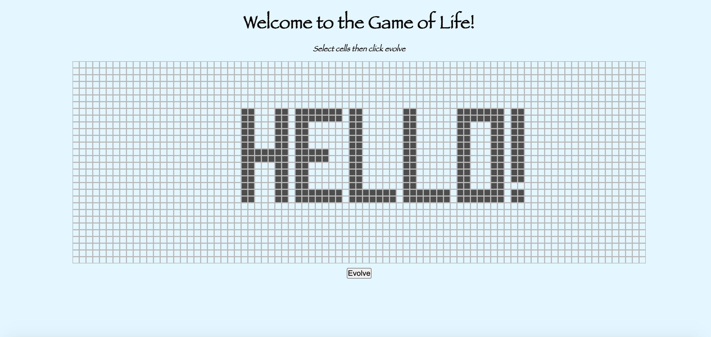
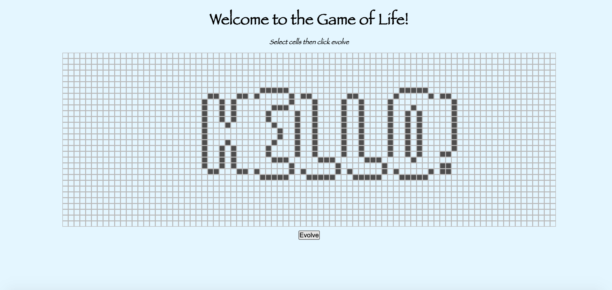
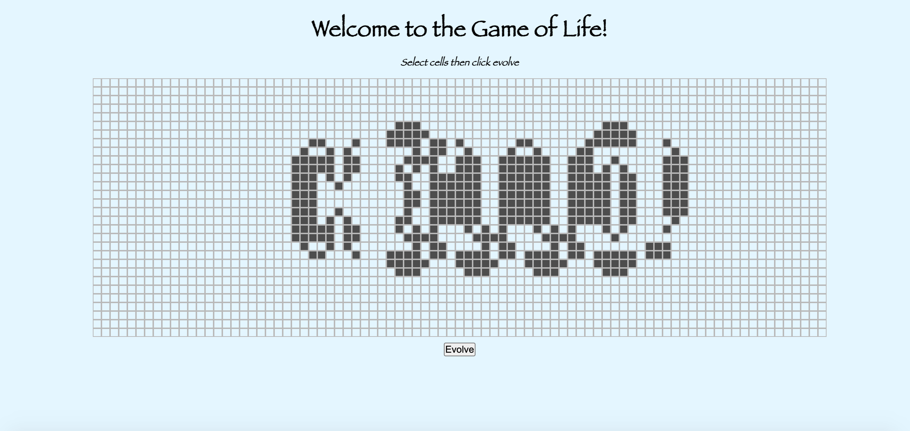
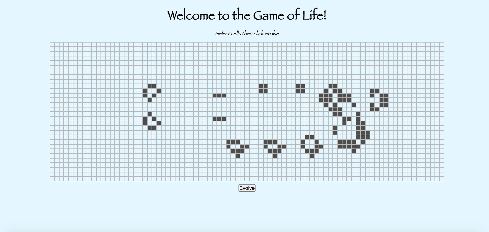

# Conway's Game of Life

The Game of life is a zero player game developed in the 70's by John Horton Conway. Check out the [Wikipedia article](https://en.wikipedia.org/wiki/Conway%27s_Game_of_Life) for a full description.
The evolving state of the game is determined by the initial configuration - some configurations become infinitely evolving constellations, others eventually evolve into a stable patterns, whilst others die off completely.
It is commonly used as a tech test as it can be solved in many different ways that clearly show the level of the programmer.

### The Brief

The rules are as follows:

* The game evolves in turns, commonly known as 'ticks'.
* All changes occur at the same time.
* Any live cell with 2 or 3 live neighbours survives until next tick.
* Any live cell with less than 2 live neighbours dies (underpopulation).
* Any live cell with more than 3 live neighbours dies (overpopulation).
* Any dead cell with exactly 3 neighbours becomes a live cell (reproduction).

Write code that is capable of calculating each new generation, given a starter board. Although you don't have to build a visualisation tool to be able to see the evolution, it should be easy to extend the program to add on a web or command line UI.

# Getting Started
To run tests:

`open SpecRunner.html`

To open the User Interface (UI): 

`open index.html`

# Planning 
1. TDD a Game class with a function 'tick' to hold all the logic outlined above.
2. Create an index.html file to display the grid on the browser.
3. Create an interface.js to file to make the browser update asyncronously (with jQuery) 

# Approach

##### My approach to designing this solution was as follows:  
1. Planning 
  - I did the above planning before writing any code.
2. Game class
  - I wrote the Game class code using TDD. I worked my way through the different requirements by writing tests, passing them and refactoring. 
3. Create a UI for the browser. 
4. Link the UI to the Game class to access its logic. 

### Comments 
- In retrospect, I would have approached this task differently. I would have started with the UI and interface.js. From there, I would let the UI inform how I wanted to structure the game class. I had orginially planned to have one instance of the game class and each time the button was clicked, game.tick() would be called. However it became clear (after creating the UI) that it would be simpler to create a new instance of game with each click.  

There are currently some redundancies in the code. I have left them in for now, as I think they could be useful for future expansion.

# Structure 
##### I structured my code as follows:
- One 'Game' class to contain all the logic of how the cells update.
- UI to allow the user to set the starting grid and see how it progresses with each 'tick'. 

# Dependencies
- Jasmine - to test the Game class.
- HTML, CSS, JS - for the UI.

# Future steps
I have structured the code in such a way that the following steps could be made:  
1. The user can set the grid size.
2. The user can click a button which continuosly updates the grid (e.g. every second).
3. Deployment to Heroku.

# Demo 
Below is a demostration of the app in action. The screenshots show the first, second, third and tenth iterations, in that order.

### References
I referred to [this](https://javascript.plainenglish.io/the-game-of-life-using-javascript-fc1aaec8274f) blog for guidance in creating the UI.

